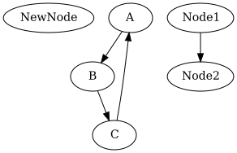

# CSE464 Course Project

## Building the Project

To build the project, run the following command in the project root directory:

```
mvn package
```

This command will compile the code, run the tests, and create a JAR file in the `target` directory.

## Running the Project

After building the project, you can run the `Main` class using the following command:

```
java -cp target/CSE464-2023-syadav42-1.0-SNAPSHOT.jar Main
```

## Features and Usage

### Example input
```
input.dot:

digraph G {
  A -> B;
  B -> C;
  C -> A;
}
```

### 1. Parse a DOT graph file

```java
GraphManager manager = new GraphManager();
manager.parseGraph("path/to/your/input.dot");
System.out.println(manager.toString());
```

#### Output:
```
Parsing input.dot file...
Parsing file: input.dot
Parsed graph: digraph "G" {
"A" -> "B"
"B" -> "C"
"C" -> "A"
}
Successfully parsed input.dot

Initial Graph Information:
Number of nodes: 3
Node labels: [A, C, B]
Number of edges: 3
Edges: [C -> A, B -> C, A -> B]
```

### 2. Add nodes

```java
manager.addNode("NewNode");
manager.addNodes(new String[]{"Node1", "Node2", "Node3"});
```

#### Output:
```
Adding nodes and edges...
Added node 'NewNode': true
Added nodes: Node1, Node2
```

### 3. Add edges

```java
manager.addEdge("Node1", "Node2");
```

#### Output:
```
Added edge 'Node1' -> 'Node2': true
```
### 4. Output to DOT file and PNG

```java
manager.outputDOTGraph("path/to/output.dot");
manager.outputGraphics("path/to/output.png", "png");
```

#### Output:
```
Outputting to DOT and PNG...
DOT output:
digraph {
  "Node1" -> "Node2"
  "A" -> "B"
  "C" -> "A"
  "B" -> "C"
}
Successfully output graph to output.dot
Graphics output saved to: output.png in PNG format
Graphics output saved to: output.png

PNG:

```

## Running Tests

To run the tests, use the following command:

```
mvn test
```

## GitHub Commits

- Feature 1 (Parse Graph): https://github.com/satyalyadav/CSE-464-2024-syadav42/commit/6864b69c6fa51dcfd7ef4598b6bc5cac67fdde6d
- Feature 2 (Add Nodes): https://github.com/satyalyadav/CSE-464-2024-syadav42/commit/c75c667bb9b83adebc6025f6f72e8a6fe96753ff
- Feature 3 (Add Edges): https://github.com/satyalyadav/CSE-464-2024-syadav42/commit/86ce05d49ef704968baabd443a605c1d84879ed1
- Feature 4 (Output Graph): https://github.com/satyalyadav/CSE-464-2024-syadav42/commit/29c02e67cb34e89810a41d813f69a65061f42bab