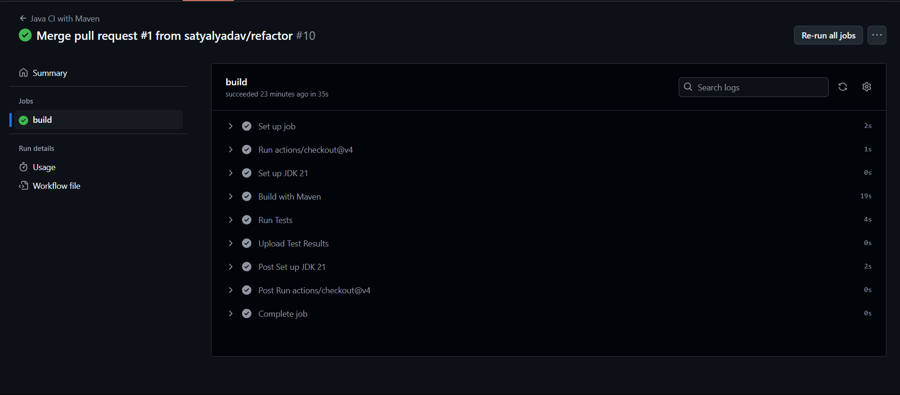

# CSE464 Course Project

## Building the Project

To build the project, run the following command in the project root directory:

```
mvn package
```

This command will compile the code, run the tests, and create a JAR file in the `target` directory.

## Running the Project

After building the project, you can run the `Main` class using the following command:

```
java -cp target/CSE464-2023-syadav42-1.0-SNAPSHOT.jar Main
```

## Features and Usage

### Example input
```
input.dot:

digraph G {
  A -> B;
  B -> C;
  C -> A;
}
```

### 1. Parse a DOT graph file

```java
GraphManager manager = new GraphManager();
manager.parseGraph("path/to/your/input.dot");
System.out.println(manager.toString());
```

#### Output:
```
Parsing input.dot file...
Parsing file: input.dot
Parsed graph: digraph "G" {
"A" -> "B"
"B" -> "C"
"C" -> "A"
}
Successfully parsed input.dot

Initial Graph Information:
Number of nodes: 3
Node labels: [A, C, B]
Number of edges: 3
Edges: [C -> A, B -> C, A -> B]
```

### 2. Add nodes

```java
manager.addNode("NewNode");
manager.addNodes(new String[]{"Node1", "Node2", "Node3"});
```

#### Output:
```
Adding nodes and edges...
Added node 'NewNode': true
Added nodes: Node1, Node2
```

### 3. Add edges

```java
manager.addEdge("Node1", "Node2");
```

#### Output:
```
Added edge 'Node1' -> 'Node2': true
```
### 4. Output to DOT file and PNG

```java
manager.outputDOTGraph("path/to/output.dot");
manager.outputGraphics("path/to/output.png", "png");
```

#### Output:
```
Outputting to DOT and PNG...
DOT output:
digraph {
  "Node1" -> "Node2"
  "A" -> "B"
  "C" -> "A"
  "B" -> "C"
}
Successfully output graph to output.dot
Graphics output saved to: output.png in PNG format
Graphics output saved to: output.png
```
#### Output PNG:


## New Features in Part 2

### 5. Remove Nodes and Edges

```java
// Remove a single node
manager.removeNode("Node1");

// Remove multiple nodes
manager.removeNodes(new String[]{"Node2", "Node3"});

// Remove an edge
manager.removeEdge("A", "B");
```

#### Example Output:
```java
=== Creating Initial Graph ===
Initial Graph:
Number of nodes: 4
Node labels: [C, D, B, A]
Number of edges: 4
Edges: [A -> B, A -> D, C -> D, B -> C]


=== Removing Node 'B' ===
After removing node 'B':
Number of nodes: 3
Node labels: [A, C, D]
Number of edges: 2
Edges: [C -> D, A -> D]


=== Removing Edge A->D ===
After removing edge 'A->D':
Number of nodes: 3
Node labels: [C, A, D]
Number of edges: 1
Edges: [C -> D]


=== Attempting to remove non-existent node ===
```

### 6. Graph Search (BFS and DFS)

```java
// Search using BFS
GraphPath bfsPath = manager.GraphSearch("A", "D", Algorithm.BFS);

// Search using DFS
GraphPath dfsPath = manager.GraphSearch("A", "D", Algorithm.DFS);

// Print the found paths
System.out.println("BFS Path: " + bfsPath);  // Output: A -> B -> C -> D
System.out.println("DFS Path: " + dfsPath);  // Output: A -> D
```

#### Example Output:

```java
=== Creating Graph for Path Finding ===
Graph Structure:
Number of nodes: 5
Node labels: [D, C, A, E, B]
Number of edges: 5
Edges: [A -> B, D -> E, B -> C, A -> E, C -> D]


=== Finding path from A to E using BFS ===
BFS Path: A -> E

=== Finding path from A to E using DFS ===
DFS Path: A -> B -> C -> D -> E

=== Finding path in cyclic graph ===
Cyclic Graph Structure:
Number of nodes: 3
Node labels: [A, C, B]
Number of edges: 3
Edges: [C -> A, B -> C, A -> B]

BFS Path A->C: A -> B -> C
DFS Path A->C: A -> B -> C
```


## New Features in Part 3

### 7. Code Refactoring

Five main refactoring changes were implemented to improve code quality:

1. Extract File Operations:
   - Extracted file I/O operations into dedicated class
   - Improved separation of concerns

2. Extract Path Finding Logic:
   - Moved search algorithms to separate classes
   - Enhanced modularity and testability

3. Consolidate Node Removal:
   - Combined duplicate removal code
   - Reduced code duplication

4. Variable Extraction:
   - Improved readability in addEdge method
   - Enhanced code clarity

5. Method Renaming:
   - Updated method names to follow conventions
   - Improved code consistency

### 8. Template Pattern Implementation

The template pattern was implemented to standardize graph search algorithms:

```java
// Using template pattern for graph search
GraphSearchTemplate bfsSearch = new BFSSearch(graph);
GraphSearchTemplate dfsSearch = new DFSSearch(graph);
```

### 9. Strategy Pattern Implementation

Strategy pattern allows runtime algorithm selection:

```java
// Using strategy pattern for algorithm selection
GraphSearchStrategy strategy = SearchStrategyFactory.getStrategy(Algorithm.BFS);
GraphPath path = strategy.findPath(graph, "A", "B");
```

### 10. Random Walk Search

New random walk implementation using both patterns:

```java
// Using random walk search
GraphPath randomPath = manager.GraphSearch("A", "C", Algorithm.RANDOM_WALK);
```

Random Walk Output:
```
random testing
visiting Path{nodes=[Node{a}]}
visiting Path{nodes=[Node{a}, Node{b}]} 
visiting Path{nodes=[Node{a}, Node{b}, Node{c}]}
Path{nodes=[Node{a}, Node{b}, Node{c}]}

random testing
visiting Path{nodes=[Node{a}]}
visiting Path{nodes=[Node{a}, Node{e}]} 
visiting Path{nodes=[Node{a}, Node{e}, Node{f}]} 
visiting Path{nodes=[Node{a}, Node{b}]} 
visiting Path{nodes=[Node{a}, Node{b}, Node{c}]}
Path{nodes=[Node{a}, Node{b}, Node{c}]}
```

## Continuous Integration

This project uses GitHub Actions for continuous integration. Every push to the repository automatically:
- Builds the project
- Runs all tests
- Reports test results



## Running Tests

To run the tests, use the following command:

```
mvn test
```

## GitHub Commits

### Part 1 Features
- Parse Graph: [6864b69](https://github.com/satyalyadav/CSE-464-2024-syadav42/commit/6864b69c6fa51dcfd7ef4598b6bc5cac67fdde6d)
- Add Nodes: [c75c667](https://github.com/satyalyadav/CSE-464-2024-syadav42/commit/c75c667bb9b83adebc6025f6f72e8a6fe96753ff)
- Add Edges: [86ce05d](https://github.com/satyalyadav/CSE-464-2024-syadav42/commit/86ce05d49ef704968baabd443a605c1d84879ed1)
- Output Graph: [29c02e6](https://github.com/satyalyadav/CSE-464-2024-syadav42/commit/29c02e67cb34e89810a41d813f69a65061f42bab)

### Part 2 Features
- Remove APIs: [4fa5ea5](https://github.com/satyalyadav/CSE-464-2024-syadav42/commit/4fa5ea58db38933d6b0222782fde26a24c6619ee)
- CI Setup: [58e0e20](https://github.com/satyalyadav/CSE-464-2024-syadav42/commit/58e0e20e93b4da7f0b6129b146432a81fb15839f)
- BFS Implementation: [2cea339](https://github.com/satyalyadav/CSE-464-2024-syadav42/commit/2cea339c5b3fce6273b5a461623641b3bbd714f1)
- DFS Implementation: [3c43d5a](https://github.com/satyalyadav/CSE-464-2024-syadav42/commit/3c43d5aaafd74f92448263093ca1bd7e44047e8a)
- Algorithm Selection: [a3e4f7c](https://github.com/satyalyadav/CSE-464-2024-syadav42/commit/a3e4f7cbc13ea547d62d1e3796486668c70c5fd1)

### Part 3 Features
- Code Refactoring
  - Extract File Operations: [6997db1](https://github.com/satyalyadav/CSE-464-2024-syadav42/commit/6997db1be8f62e5acc46a67aeb27c37920285e4f)
  - Extract Path Finding Logic: [e16b967](https://github.com/satyalyadav/CSE-464-2024-syadav42/commit/e16b96760cc59e5ef051b6b08a8ac018b6bd75c5)
  - Consolidate Node Removal: [3d8d723](https://github.com/satyalyadav/CSE-464-2024-syadav42/commit/3d8d72337d6e60f08808339d81af272ddb8b49a8)
  - Variable Extraction: [3b9b73d](https://github.com/satyalyadav/CSE-464-2024-syadav42/commit/3b9b73d6d2e8bf84411ac70c9858ddfc2aff8626)
  - Method Renaming: [b086ddb](https://github.com/satyalyadav/CSE-464-2024-syadav42/commit/b086ddba2b8b6f61cb1d47f536a114cd02554d4d)
- Template Pattern Implementation
  - Base Template: [a297e92](https://github.com/satyalyadav/CSE-464-2024-syadav42/commit/a297e922c4ed7ef5dd7729710196503e9413bf20)
  - Template Refinements: [15d4e1e](https://github.com/satyalyadav/CSE-464-2024-syadav42/commit/15d4e1ee17e87969d8416a0fdbdf9cbf46ee52db)
- Strategy Pattern Implementation: [9afa0ad](https://github.com/satyalyadav/CSE-464-2024-syadav42/commit/9afa0ad07a95396b3b09de7bf948c86fa96db85b)
- Random Walk Search: [a64a1a0](https://github.com/satyalyadav/CSE-464-2024-syadav42/commit/a64a1a0bac2ea2309dad075d891f2aebab9543b1)

### Pull Request

Part 3 Pull Request: [Pull Request #1](https://github.com/satyalyadav/CSE-464-2024-syadav42/pull/1)

### Branches
- Main: [main](https://github.com/satyalyadav/CSE-464-2024-syadav42/tree/main)
- BFS Branch: [bfs](https://github.com/satyalyadav/CSE-464-2024-syadav42/tree/bfs)
- DFS Branch: [dfs](https://github.com/satyalyadav/CSE-464-2024-syadav42/tree/dfs)
- Refactor: [refactor](https://github.com/satyalyadav/CSE-464-2024-syadav42/tree/refactor)

### Merges
- BFS Merge: [bf55837](https://github.com/satyalyadav/CSE-464-2024-syadav42/commit/bf55837be34316b4ff6b29d5a5c9a9d696309fd5)
- DFS Merge with Algorithm Selection: [a3e4f7c](https://github.com/satyalyadav/CSE-464-2024-syadav42/commit/a3e4f7cbc13ea547d62d1e3796486668c70c5fd1)
- Refactor Merge: [fcbe375](https://github.com/satyalyadav/CSE-464-2024-syadav42/commit/fcbe3753dac952760644170cddb34fc153ec637d)